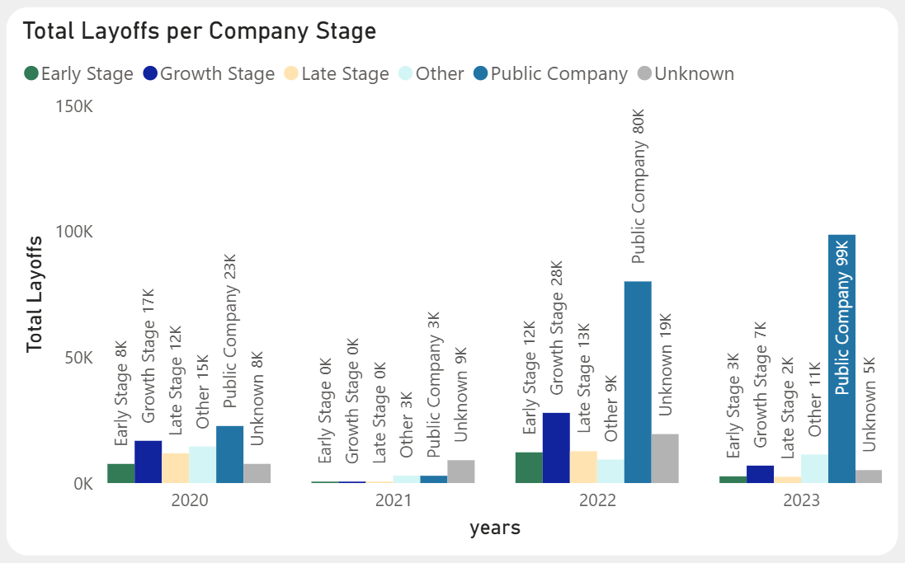

<h1 align="center">World Layoffs Overview</h1>

## Summary
This project analyzes global layoffs across companies and industries from 2020 to 2023. The main objective is analyzing the data through the lens of world events that affected global job markets and identifying patterns accross sectors. 
The project focuses on understaning:
- Which industries, countries and companies experienced the most layoffs
- When layoffs peaked across the board
- The evolution of the layoffs as years went by
- Which countries led layoffs each year

## Dashboard Preview

### Top Skills
- SQL (MySQL)
- Data Cleaning
- Window Functions
- Exploratory Data Analysis
- Data Visualization
- Power BI Dashboard Development

## World Layofs Analysis

### 1. Technology sector heavily impacted
Technology companies account for the largest share of layoffs accross the world. This sector had an important expansion during the pandemic, followed by a significant correction in the market as the status of the emergency evolved. 

### 2. Different industries saw the impact at different stages
The data shows that different industries peaked at different stages in the 2020-2023 timeframe. The transportation and finance markets had the most layoffs directly after the pandemic shutdowns in 2020. By 2023, the growth experience in the technology sector (here classified as 'Other') saw a rapid decline as the world returned to normalcy. 

### 3. Layoffs accelerated in 2022-2023
Monthly records show a sharp spike in 2022 into 2023, suggesting macroeconomic pressures following relative stability since the 2020 layoffs due to post-pandemic restructuring and correction.

### 4. The United States dominated layoff events
The United States job market saw the largest share of the layoffs, which signals the country's heavy investment and focus on the technology sector and startup ecosystem. 

### 5. Public companies conducted the most layoffs 
Company funding or ownership stage was categorized for this analysis, in order to understand layoffs trends for each stage in 2020-2023. Below is the query utilized for this insight:

	SELECT YEAR(`date`) AS years,
	CASE
		WHEN stage IN ('Seed','Series A','Series B') THEN 'Early Stage'
        WHEN stage IN ('Series C','Series D','Series E') THEN 'Growth Stage'
        WHEN stage IN ('Series F','Series G','Series H','Series I','Series J') THEN 'Late Stage'
        WHEN stage = 'Post-IPO' THEN 'Public Company'
        WHEN stage='Unknown' OR stage IS NULL THEN 'Unknown'
        ELSE 'Other'
    END AS stage_category,
	SUM(total_laid_off) AS layoffs
	FROM layoffs_staging2
	WHERE SUBSTRING(`date`,1,7) IS NOT NULL
	GROUP BY years, stage_category;

The results show that public companies lead the layoffs waves each year in 2020, 2022 and 2023 with an upward trend once the pandemic crisis had settled. Conversely, companies in early and growth stages conducted more layoffs at the start of the pandemic, and later settled when restrictions were lifted.

### 6. 

## Dataset & Tools
- Source: layoffs.csv
- Tools: GitHub, MySQL, PowerBI
- Key variables in data source:

| Column | Description |
|--------|-------------|
| company | Company conducting layoffs |
| industry | Industry classification |
| country | Country where layoffs occurred |
| total_laid_off | Number of employees laid off |
| percentage_laid_off | Share of workforce laid off |
| funds_raised_millions | Funding raised prior to layoffs |
| date | Date of the layoff event |
| stage | Funding or ownership stage of the company |

